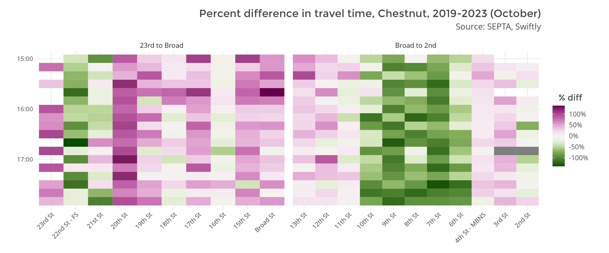
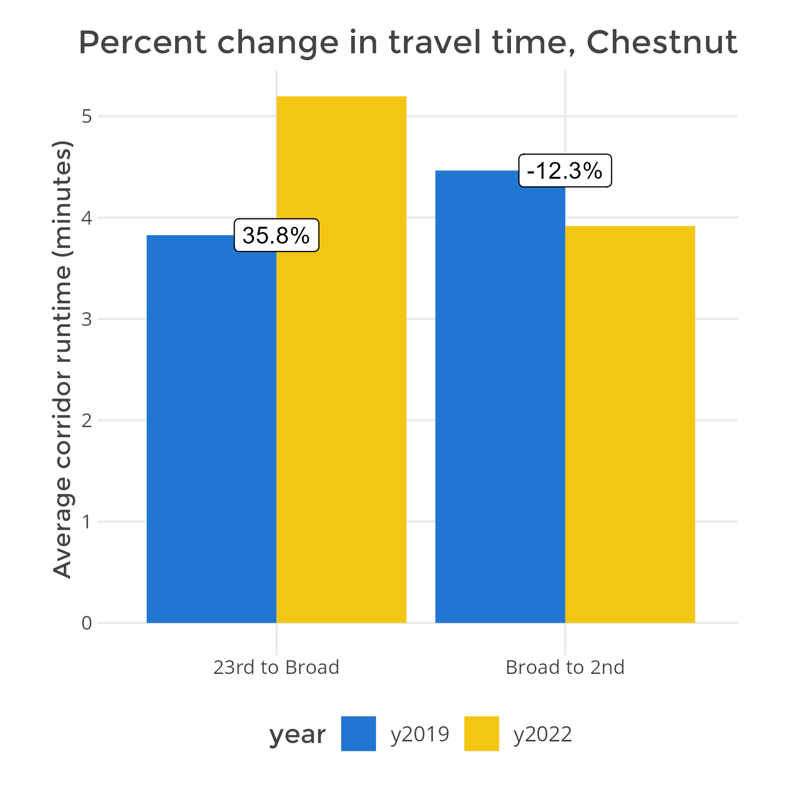

# ocs-transit-reports

R scripts for OCS before-after transit data reports

## About

This codebase is an end-to-end pipeline for transit data analysis, from pulling user-defined transit performance data through simple input parameters to descriptive and interpretive visualization. The main purpose is to compare performance metrics before and after a particular improvement on a transit corridor, though a continuous analysis across a time series could also be desirable. There are four main steps in the pipeline:

1) Build a "study corridor" based upon predefined start and end stops in ```corridors.csv``` file. Because we often deploy improvements incrementally along partial segments of a corridor, it's useful to define subcorridors of similar length that compare performance on an improved and unimproved section in the same timeframe. Through SEPTA's latest GTFS feed, this gets all bus routes that use part of or the whole corridor, and unifies them to build a "route-agnostic" corridor.
2) Using this stop-level study corridor, pull stop-to-stop traveltime data from the Swiftly/AVL API (APC data is forthcoming)[^1]. The default timeframe to pull data is Tues-Thurs, 3PM-6PM for one month of stop times, for the same month in a year prior to and during the improvement. For example: for an improvement that was installed May 2022, a valid before-after comparison could be October 2019 with October 2022[^2]. This also excludes any user-defined dates in analysis for known detours or special events.
3) Aggregate travel time data across multiple routes by stop, and then bin temporally by a predefined time interval (default: 10 minutes). This is the basic "panel" dataset over space (stops) and time (interval) which is used for statistical analysis, with each row representing a stop-interval. Various derived metrics including excess travel time, travel time variability, and buffer index time are calculated here.
4) Visualize using ```ggplot```. These will be redefined as modular functions producing standard graphs and charts. Ad-hoc charts can be considered on a case-by-case basis, and run via additional scripts.

Ultimately, the user will run the entire pipeline through ```sandbox.R```, which uses the YAML-based ```config``` package to manage specific corridor study configurations. New corridor stop bounds are inputted in ```corridors.csv```, and the same user-defined corridor name along with custom parameters (date range, exclude dates, time of day, interval) are inputted in ```config.yml``` as a new environment config. Then, set the correct configuration name in the first line of ```sandbox.R```, and run the script.

## Scope of performance metrics

### Statistics

All statistics are calculated on the stop-interval level unless specified.

1. Travel time descriptive stats: mean, standard deviation
    1. 10/90/95th-percentile travel time
2. Excess travel time: ```travelTime - fixedTravel``` calculated during the Swiftly API call, then aggregated at panel creation
3. Buffer index of run time, expressed in ratio or duration beyond run time
4. Trip count: number of trips included in each panel row.
5. Speed (WIP): Mean, standard deviation. Most useful for maps
6. Percent change or percent difference of any metric above before and after improvement (done during visualization)

### Visualization

1. Heatmap: x-axis is stop, y-axis is time interval. Color can be any statistic above but usually is mean travel time. Usually faceted by subcorridor.

2. Comparison barchart: Compare one statistic before and after, averaged across all stops per subcorridor. Usually expressed for mean travel time.

3. Map (WIP): A stop-to-stop segment map usually showing average speed or % change in speed

[^1]: AVL data is best used for travel times when the bus is moving, and APC data is best used for dwell times (based upon opening and closing of doors).
[^2]: In the post-pandemic recovery period, general traffic and SEPTA bus ridership was significantly less than normal periods, so it is generally advisable to avoid analyzing data in 2020 and 2021.
